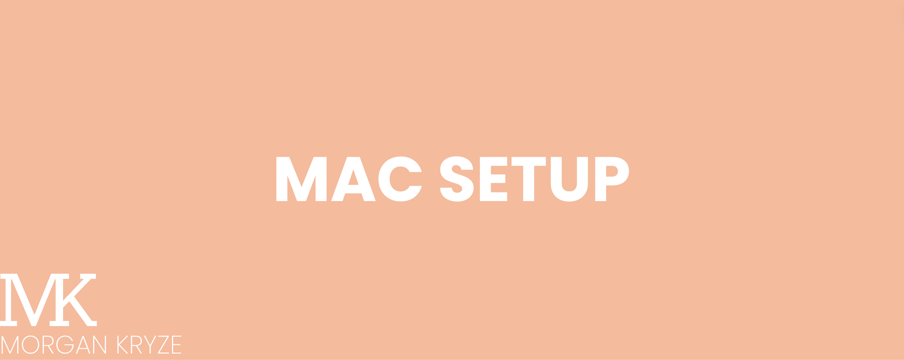

# Mac-Setup

> A list of useful tools and configurations for a Mac setup (more features for developers).



## Homebrew

The first step to this setup is to install Homebrew.

Homebrew is a package manager for macOS. It allows you to install and manage software packages from the command line. We will be using it for all the installations. All details [here](https://www.digitalocean.com/community/tutorials/how-to-install-and-use-homebrew-on-macos).

> [!TIP]
> I highly recommend you to use Homebrew to install your apps instead of the app store or the packages by yourself. It is a lot easier and cleaner (sometimes safer).

```bash
/bin/bash -c "$(curl -fsSL https://raw.githubusercontent.com/Homebrew/install/HEAD/install.sh)"
```

## Classic tools

### Productivity

Raycast is an app that replaces the spotlight search on your Mac. It is a productivity tool that allows you to search for files, apps, and more. It also has a lot of plugins that you can use to customize it to your needs. (Free | [Open source](https://github.com/raycast))

```bash
brew install raycast
```

Maccy is a clipboard manager that allows you to keep track of your clipboard history. It is a very useful tool that can save you a lot of time. (Free | [Open source](https://github.com/p0deje/Maccy))

```bash
brew install maccy
```

Arc is a Safari replacement that is faster and more privacy-focused. It is a great tool to use if you are looking for a new browser based on chromium, open-source version of chrome. (Free | [Proprietary](https://arc.net/))

```bash
brew install arc
```

Notion is a note-taking app that allows you to take notes, create to-do lists, and more. (Free but has [paid plans](https://www.notion.so/fr-fr/pricing) | [Proprietary](https://www.notion.so/))

```bash
brew install notion
```

Thunderbird is an email client that allows you to manage your emails. (Free but has [paid extension for microsoft 365 emails](https://addons.thunderbird.net/en-US/thunderbird/addon/owl-for-exchange/) | [Open source](https://www.thunderbird.net/))

```bash
brew install thunderbird
```

Pomatez is a pomodoro timer that allows you to manage your time and focus on your work. (Free | [Open source](https://github.com/zidoro/pomatez))

```bash
brew install pomatez
```

Dropzone is a file manager that allows you to manage your files and automatize actions. (Free but has [paid plans](https://aptonic.com/)| [Proprietary](https://aptonic.com/))

```bash
brew install dropzone
```

> [!NOTE]
> For Dropzone, the installation gives you 14 days of free trial for the pro version. After that, just keep the free version or buy the pro version.

CheatSheet is a tool that allows you to display all the shortcuts of the app available. (Free | [Proprietary](https://www.mediaatelier.com/CheatSheet/))

```bash
brew install cheatsheet
```

### Photo & Video

ImageOptim is a tool that allows you to compress images and remove metadata. (Free | [Open source](https://github.com/ImageOptim/ImageOptim))

```bash
brew install imageoptim
```

VLC is a media player that allows you to play videos and music. (Free | [Open source](https://www.videolan.org/))

```bash
brew install vlc
```

Draw.io is a diagram editor that allows you to create diagrams and flowcharts. Can be used, online, on desktop or even in VsCode (just download the extension). (Free | [Open source](https://github.com/jgraph/drawio))

```bash
brew install drawio
```

Inkscape is a vector graphics editor that allows you to create and modify images from various formats. (Free | [Open source](https://inkscape.org/))

```bash
brew install inkscape
```

Canva is a graphic design platform that allows you to create and modify presentations, banners, posts or any kind of visuals. It is available online too. (Free but has [paid plans](https://www.canva.com/pricing/)| [Proprietary](https://www.canva.com/))

```bash
brew install canva
```

#### Bonus

Capture screenshot to jpg format instead of png. Run this command:

```bash
defaults write com.apple.screencapture type jpg
```

### Security

Bitwarden is a password manager that allows you to store and manage your passwords securely. (Free but has [paid plans](https://bitwarden.com/pricing/)| [Open source](https://github.com/bitwarden))

```bash
brew install bitwarden
```

> [!TIP]
> You may also take the bitwarden extension on your browser, but do not activate the autofill option to prevent any security breach. Some website may hide the password field and the autofill option may fill it without your consent and let them collect these data.

LuLu is a firewall that allows you to control the traffic of your apps and processes. (Free | [Open source](https://github.com/objective-see/LuLu))

```bash
brew install lulu
```

ClamAV is an antivirus that allows you to scan your files and folders for viruses. (Free | [Open source](https://www.clamav.net/))

> [!CAUTION]
> This is not a real-time antivirus, it is only a scanner. You may use it to scan your files and folders, but it will not protect you from viruses in real-time.

```bash
brew install clamav
```

> [!TIP]
> You may use it as a service using `sudo brew services start clamav`.

Onyx is a maintenance tool that allows you to clean your system and optimize it. (Free | [Proprietary](https://www.titanium-software.fr/en/onyx.html))

```bash
brew install onyx
```

### Utilities

AppCleaner is a tool that allows you to uninstall apps and their files by scanning your system and the app dependencies. (Free | [Proprietary](https://freemacsoft.net/appcleaner/))

```bash
brew install appcleaner
```

> [!TIP]
> I recommend using Homebrew by default, but AppCleaner is a good alternative for manual uninstall.

MonitorControl is a tool that allows you to control the brightness and volume of your external monitors. (Free | [Open source](https://github.com/MonitorControl/MonitorControl))

```bash
# Control other displays
brew install monitorcontrol
```

Stats is a tool that allows you to display your computer stats on the menu bar. (Free | [Open source](https://github.com/exelban/stats))

```bash
# Computers stats displays on menu bar
brew install stats
```

Though DevToys is a wonderful tool for programmers, it has several features that can be useful for everyone. It is a collection of tools that can be used to improve your productivity. (Free | [Open source](https://github.com/veler/DevToys))

```bash
# General dev tools
brew install devtoys
```

OnlySwitch is a All-in-One menu bar app, hide MacBook Pro's notch, dark mode, AirPods, Shortcuts. (Free | [Open source](https://github.com/jacklandrin/OnlySwitch))

```bash
# Easy customizable shortcuts
brew install only-switch
```

Rectangle is a window manager that allows you to manage your windows on your Desktop with your keyboard. (Free | [Open source](https://github.com/rxhanson/Rectangle))

> [!WARNING]
> If you consider using Yabai (tiling manager availabe in the developper tools section), you MUST NOT use Rectangle. It will conflict with Yabai and may cause some issues.

```bash
brew install rectangle
```

## Developper tools

> [!IMPORTANT]
> This part is only for developpers, do not mind otherwise.

### Terminal configuration

We see how to use and setup the `.zshrc` and `.zshenv` files.

Both files are located in your home directory(`~`) and are used to configure your shell (terminal) and its tools and shortcuts. It is a hidden file, but you can view it by typing `ls -a` in your terminal.

Here is an example of a `.zshrc` file:

```bash
# This file contains the configuration for the Zsh shell.
# It sets up various aliases, plugins, and custom functions.

# Clears the terminal
clear && printf '\e[3J'

# Oh-my-zsh
ZSH_THEME="bira"
plugins=(
        git
        zsh-autosuggestions
        zsh-syntax-highlighting
)
source $ZSH/oh-my-zsh.sh

# homescreen customization
neofetch

# Display the" current directory files
alias dr="lsd -lah"

# Display the" current directory files in a tree
alias dt="lsd --tree ."

# Open a project in Visual Studio Code and close the terminal
alias opn="code .;exit;"

# Reopen a project in Visual Studio Code
alias reopn="code -r ."

# Yabai functions for tiling management
source ~/Yabai-Setup/src/yabai-setup.sh
```

Here is an example of a `.zshenv` file:

```bash
# This file contains the environment variables for the Zsh shell.
export ZSH="$HOME/.oh-my-zsh"

# Flutter tools
export PATH="$PATH:/Users/your-user/Documents/.../SDK/flutter/bin"
export PATH="$PATH":"$HOME/.pub-cache/bin"

# .NET tools
export PATH="$PATH:/Users/your-user/.dotnet/tools"

# Keys
export OPENAI_API_KEY=your_openai_key
```

> [!CAUTION]
> Do not copy and paste these file directly into your terminal. Go throuh the process below to install the tools and then add the aliases and plugins to your `.zshrc` file when asked to. The `.zshenv` file is only an example, do not copy and paste it without updating the paths and keys you want to use.

### Oh My Zsh

By default, the pre-configured shell on MacOS is zsh. Oh My Zsh is an open source, community-driven framework for managing your zsh configuration. It comes bundled with a ton of helpful functions, helpers, plugins, themes, and a few things that make you shout... "Oh My Zsh!". Install it with the following command:

```bash
sh -c "$(curl -fsSL https://raw.githubusercontent.com/ohmyzsh/ohmyzsh/master/tools/install.sh)"
```

For the Theme part, I use bira, but you have a lot of choice. You can find them [here](https://github.com/ohmyzsh/ohmyzsh/wiki/Themes).

For the plugins, I use git, [zsh-autosuggestions](https://github.com/zsh-users/zsh-autosuggestions/blob/master/INSTALL.md#oh-my-zsh) (gives you history of your commands) and [zsh-syntax-highlighting](https://github.com/zsh-users/zsh-syntax-highlighting/blob/master/INSTALL.md#oh-my-zsh) (highlights in green if your command is valid). Once installed, you have to add them in the plugins section of your zshrc file (like in the example above).

### neofetch

neoFetch is a command-line system information tool. It displays information about your system next to an image, generally your OS logo, or any ASCII file of your choice. This is only cosmetic and informative.

```bash
brew install neofetch
```

> [!TIP]
> You will need to add `neofetch` to your `.zshrc` file to display it at the start of each terminal session.

### lsd

lsd is a modern ls command with a lot of options and visuals.

```bash
brew install lsd
```

> [!TIP]
> You may use lsd with all of the built-in flags or define your own aliases in your `.zshrc` file to make your life easier.

### yabai

Yabai is a tiling window manager for macOS. It let you control your windows with your keyboard and gain a lot of time. To download and use it, I made this [repository](https://github.com/MorganKryze/Yabai-Setup).

### Git and versionning

Git is a free and open source distributed version control system designed to handle everything from small to very large projects with speed and efficiency.

```bash
brew install git
```

To visualize a control panel of your git workspace, you can use lazygit.

```bash
brew install lazygit
```

If you are using GitHub, you may want to use the GitHub CLI to manage your repositories and issues.

```bash
brew install gh
```

Then you may authenticate yourself with the following command:

```bash
gh auth login
```

> [!TIP]
> To make your git workspace easier to manage, I made this [repository](https://github.com/MorganKryze/Easy-Git).

### Environment managment

Miniconda is a free minimal installer for conda. It is a small, bootstrap version of Anaconda that includes only conda, Python, the packages they depend on, and a small number of other useful packages, including pip, zlib and a few others. You may use it to create development environments for many language including Python, R, Ruby, Lua, Scala, Java, JavaScript, C/ C++, C#...

```bash
brew install miniconda
```

Then init conda with the following command:

```bash
conda init "$(basename "${SHELL}")"
```

> [!TIP]
> To make your developpment environment easier to manage, I made this [repository](https://github.com/MorganKryze/Easy-Env).

### Containers

Docker is a set of platform as a service products that use OS-level virtualization to deliver software in packages called containers. Containers are isolated from one another and bundle their own software, libraries and configuration files; they can communicate with each other through well-defined channels.

```bash
brew install docker
```

To manage and visualize your containers, you can use lazydocker (same use as `lazygit`).

```bash
lazydocker
```

## Dev apps

Visual Studio Code is a source-code editor developed by Microsoft for Windows, Linux and macOS. It includes support for debugging, embedded Git control, syntax highlighting, intelligent code completion, snippets, and code refactoring.

```bash
brew install visual-studio-code
```

UTM is a virtual machine app that allows you to run any kind of VMs on your Mac. It is a great tool to test your apps on different OS or to use Windows on your Mac.

```bash
# For all kinds of VMs
brew install utm
```

UTM goes along with CrystalFetch, a tool that allows you to download the latest Windows images for UTM.

```bash
# Latest Windows images
brew install crystalfetch
```

## VsCode extensions

### General

- Better comments
- Bracket pair colorizer
- Code spell checker
- Error lens
- Edit csv
- DotENV
- Image preview
- Image Viewer
- Live Share
- Live Server
- Material Icon Theme
- PDF Preview
- Prettier
- Reload
- Todo Tree

### GitHub

- GitHub Actions
- GitHub Copilot
- GitHub Copilot Chat
- Git History

### Markdown

- Markdown All in One
- Markdown Preview Enhanced
- Markdownlint
- Markdown PDF
- Markdown Preview Mermaid Support
- Mermaid Markdown Syntax Highlighting
- MyST-Markdown

### API

- Thunder Client

### .NET

- C#
- C# Extensions
- C# Dev Kit
- C# Snippets
- .NET Install Tool
- Learn Authoring Pack

### Python

- Python
- Black Formatter
- isort
- Jupyter
- Pylance
- Python Environment Manager
- Python Extension Pack
- Python Indent

### Dart/Flutter

- Flutter
- Dart Data Class Generator
